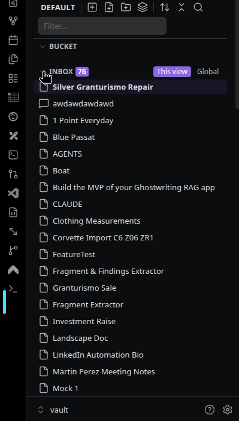
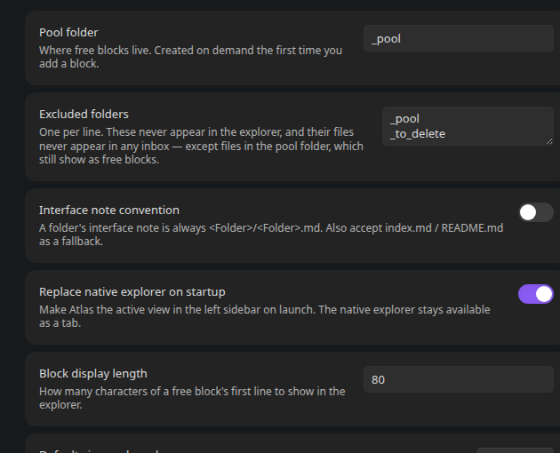

# Atlas

A replacement file explorer for Obsidian that shows every meaningful unit in your vault — blocks, files, folders — as one flat list, and lets you arrange those units into as many hierarchies as you like, without ever moving anything on disk.



**Status: pre-release, under active development.** Not yet on the community plugin store. See [TASKS.md](TASKS.md) for build progress and exactly what's been verified live vs. code-reviewed.

## Why

Folder paths in Obsidian do two jobs at once: they say what a thing *is* (stable) and what status it *has* (changes constantly). Every status change means a move, and every move breaks relative links and anything wired to that path. The fix is to stop using the folder hierarchy as an address book. Atlas separates the two jobs: the folder hierarchy on disk stays fixed, and you arrange things into any number of named **views** — drawings over the vault, not addresses for it. Rearranging becomes editing a drawing; nothing underneath moves.

## The model

### Three kinds of unit

A **unit** is anything that (a) has an address you can link to, and (b) means the same thing when taken out of its surroundings.

| Kind | Example | Address |
|---|---|---|
| **Block** | one paragraph, one bullet, one heading | `[[file#^id]]`, `[[file#Heading]]`, or a pool file (below) |
| **File** | a note, a document | `[[name]]` |
| **Folder** | a system — an agent, a codebase, a course | its interface note (below) |

### Capture at the largest self-contained level; promote on link

You capture a thing at the largest level where it's self-contained. A chat transcript is a file. An agent system is a folder. Anything *inside* a unit is internals, and internals are not units — until something outside links to them, at which point they're **promoted** into a unit in their own right. This applies at every level with no special cases: a folder is a unit at capture; a file inside it stays internals until something outside the folder links to it; a block inside that file stays internals until something links to *it*.

So `Bets/steps/step-3.md` isn't a unit today. The day something outside `Bets/` links to it, it is.

### Free blocks

A thought too small to deserve a filename still needs to exist. These are **free blocks**: markdown files in a **pool folder** (default `_pool/`, configurable) whose filenames are auto-generated IDs the user never types or sees. The explorer shows a free block by its first line, never by its ID. Under the hood it's a file; to the user it's a block. A free block that grows into a full document just keeps growing — nothing has to happen at the moment it crosses from "block" to "file".

### Modules

Every folder is a unit — a **module** whose **interface** is a note saying what the folder is and what it's responsible for, with everything else inside as internals. (Internally the codebase still calls this a "folder-unit" — the model is the same one from the original spec, just renamed in the UI.)

- The interface note is `<Folder>/<Folder>.md` by default. A module without one is still a unit; the explorer offers to create it.
- Clicking a module's name opens its interface note. Clicking its icon opens a "Module contents" view of its internals instead.
- A module's properties are its interface note's properties.
- Atlas never rearranges a module's internal organization on disk — with one deliberate, always-confirmable exception: dragging a file or block directly onto a module's **icon**. Physical moves otherwise stay in Obsidian's native explorer (still available as a tab).

### Views, bucket, inbox

- A **view** is one arrangement of units into a hierarchy. There can be many; the same unit can sit in many at once; no view is "the real one."
- Inside a view, the **bucket** is the arranged tree, and **folders** are its branches — labels, not folders on disk (not to be confused with modules, which *are* real folders on disk).
- A view's **inbox** is every unit not placed in that view. The **global inbox** is every unit placed in no view at all.
- Placing or removing a unit in the bucket never touches disk.
- Any block, file, or module can become the organizational parent of any other bucket item too, the same way a folder can — drag one onto another's row (anywhere except a module's icon, which stays reserved for the on-disk move above) to nest it underneath. Nothing on disk moves; a unit just gains a chevron and can be folded/unfolded like a folder can.
- **Multi-select**: shift-click for a range, cmd/ctrl-click to toggle one row in or out — in either the bucket or the inbox (selecting in one clears the other). Dragging any selected row moves the whole selection together; dragging a row that isn't selected drags just that row instead. Escape clears the selection; Delete removes every selected unit from the view at once. The one exception: dropping onto a module's **icon** (the real disk-move gesture above) only ever acts on a single item — a multi-item drag there is a no-op, not a bulk file move.

## Installing (development)

This plugin is not yet published to the community plugin store. To try it:

```bash
npm install
npm run build   # or `npm run dev` to watch
```

Then enable "Atlas" under Settings → Community plugins, in a vault where this folder is `.obsidian/plugins/atlas`.

## Settings



The settings panel has two tabs: **Basic** and **Status**.

### Basic

| Setting | Default | What it does |
|---|---|---|
| Pool folder | `_pool` | Where free blocks live. Created on demand the first time you add a block. |
| Excluded folders | pool folder, `_to_delete` | Never appear in the explorer or any inbox — except files in the pool folder, which still show as free blocks. |
| Interface note convention | `<Folder>/<Folder>.md` | Toggle to also accept `index.md` / `README.md` as a folder's interface note. |
| Replace native explorer on startup | on | Makes Atlas the active view in the left sidebar on launch. The native explorer stays available as a tab. |
| Block display length | 80 | How many characters of a free block's first line to show in the explorer. |
| Confirm before adding a unit to a module | on | Ask before a drag onto a module's icon physically files something into it. Off skips the confirmation, not the move. |
| Default view on launch | — | Which view Atlas opens to when the vault loads. |

### Status

- **Status sets** — create any number of named sets, each holding an ordered list of statuses (label, color, optionally flagged "Completed" and/or "Cancelled"). Each status row's "more actions" menu handles making it the set's default, marking it completed/cancelled, reordering, and removing it.
- **Color palette** — a shared set of swatches offered by every status color picker, in addition to a fully custom color.
- **Glow** — a soft glow around status dots.
- **Retain icons** — when a status is assigned, keeps the item's normal type icon visible, shrunk down inside the status dot, instead of replacing it outright.
- **Retained icon color** — only matters when "Retain icons" is on: match the icon to normal text color, or to the app's background color.

A bucket item with children (unit or meta folder — the option only appears when there's something underneath it) gets a **Statuses** entry on its right-click menu, and the **view name** itself gets the same entry for assigning statuses at the root level of the whole view (also only offered when the bucket has something in it). Both open the same modal:

- **Enable statuses** — master toggle. Everything else below is greyed out (but not discarded) while it's off.
- **Status set** — which set governs this item's (or the view's) children.
- **Inherit to subfolders** — off by default. When on, the assignment cascades past direct children all the way down the tree, until a *closer* item has its own separate assignment, which then takes over for its own subtree.
- **Hide completed** / **Hide cancelled** — hide items whose current status is flagged as one or the other, entirely (not just folded) — an item matching the active filter box search is shown anyway, regardless of this setting, same as a truncated item below.
- **Apply statuses to** — which kinds of items underneath actually receive a dot: blocks, files, modules (real folders on disk), or meta folders (the organizational, no-disk-presence kind).
- **Truncate statuses** — once at least two of a governor's children share a truncation-enabled status, they collapse into a single placeholder row (the status's dot plus a count and label — a custom label if set, otherwise a pluralized form of the status's own label) instead of listing each individually. Click the placeholder to expand it back to the individual rows (plus a "Collapse" row in its place to fold them again) — expand/collapse state resets on reload, same as any other fold state in the explorer. An item matching the active filter box search is always shown on its own, never folded into a placeholder.

When enabled, the governed children each show a colored dot for the set's status — the governing item itself is unaffected, only what's underneath it. Inbox items (not yet placed in any view) can't have a status assigned until they're placed in a bucket. Hide always takes precedence over truncate — a hidden item is never counted toward, or shown as part of, a truncated group's placeholder either.

**Clicking a status dot directly** opens a small popup listing every status in the governing set, with its own color swatch — pick one to change that specific item's status (e.g. Triage → Complete), independent of its siblings. The item's own row click (open) and right-click (full menu) are unaffected — only the dot itself has this behavior. For a module whose icon is currently a status dot, viewing its contents moves to the right-click menu ("View module contents") instead of the plain click, which now means "change status" like everywhere else.

## Commands

| Command | What it does |
|---|---|
| `Atlas: Add block` | Creates a new free block in the pool folder and opens it with the cursor ready to type — no filename prompt. |
| `Atlas: Open explorer` | Opens/focuses the Atlas view in the left sidebar. |
| `Atlas: Switch view…` | Fuzzy-picks another view and makes it active. |
| `Atlas: Place active file in view…` | Fuzzy-picks a view, then a folder (or the bucket root) within it, and places the active file there — the keyboard/mobile equivalent of dragging it in. |
| `Atlas: Reveal active file in Atlas` | Opens the explorer and, if the active file isn't placed anywhere, says so. |
| `Atlas: New view` | Prompts for a name and creates a new, empty view. |
| `Atlas: Rebuild index` | Forces a full re-scan of every unit in the vault; logs timings to the console. |

Every row in the explorer also has a right-click menu (Open, Open in new tab, Reveal in native explorer, Copy link, Duplicate (Meta), Remove from view, Place in view…), and folders can be renamed or deleted from the same menu. "Duplicate (Meta)" places a second reference to the same item — and, if it's a parent, a copy of everything nested under it — right next to the original, without touching disk; the copy is free to be organized independently from then on. Bucket rows (units and meta folders) also get a **Statuses** option — see the Status settings section above.

## Documentation

See [`docs/decisions.md`](docs/decisions.md) for the judgement calls made during the build, the alternatives considered, and why — kept current as the plugin evolves.

## License

MIT — see [LICENSE](LICENSE).
